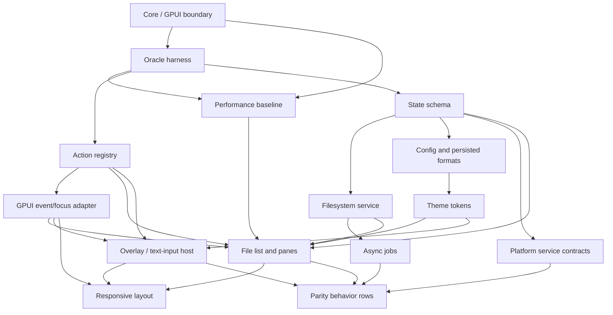

# Dependency graph (Phase 2 advisor plan review reconciled in D-0010)

Edges in feature rows are the row-specific dependency record. Foundation APIs are pre-wired by the integrator before independent feature batches. F-013 captures the baseline before performance-sensitive UI work; it does not claim a performance improvement.

F-150 (CI) depends on F-001 and F-002. It runs independently after those contracts; platform workflows must also build both independent Cargo manifests and add native smoke evidence.
